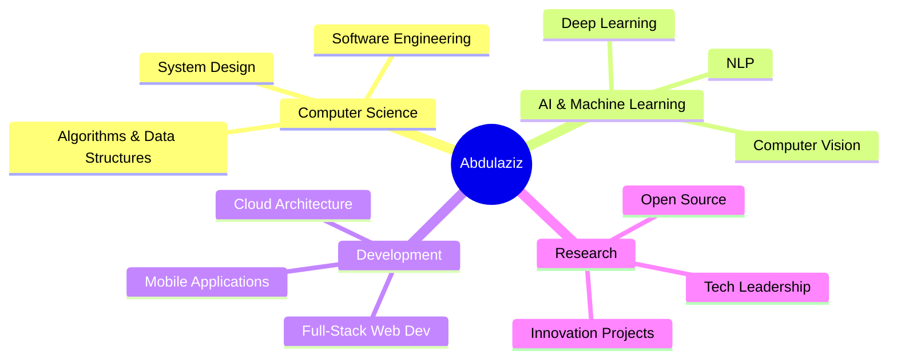

# 
Abdulaziz Alqahtani

  

  

## 
🚀 About Me

<table>
<tr>
<td>

**🎯 Current Focus**
- Advanced AI/ML Research & Development
- Scalable Web Application Architecture
- Open Source Contribution & Leadership
- Cutting-edge Technology Integration

</td>
<td>

**💡 Expertise Areas**
- Machine Learning & Neural Networks
- Full-Stack Development (React/Node.js)
- Data Science & Analytics
- Cloud Computing & DevOps

</td>
</tr>
</table>

---

## 
⚡ Core Technologies

### 🔥 Primary Stack

### 🤖 AI/ML & Data Science

### 🛠️ Development Tools

---
## 
🎓 Academic & Professional Focus

---

## 
📊 GitHub Analytics & Achievements

  

  <h3>📈 Contribution & Activity</h3>
  

  

    
<h3>📊 Detailed Statistics</h3>

    <table>
      <tr>
        <td width="45%">
          
        </td>
        <td width="45%">
          
        </td>
      </tr>
    </table>
    <table>
      <tr>
        <td width="45%">
          
        </td>
      </tr>
    </table>
  

  <h3>🏆 Recent Achievements</h3>
  

    
  

## 
💬 Let's Connect & Collaborate

  
  &nbsp;&nbsp;&nbsp;
  

 

  

  

  🚀 Crafting the future through code, one commit at a time

